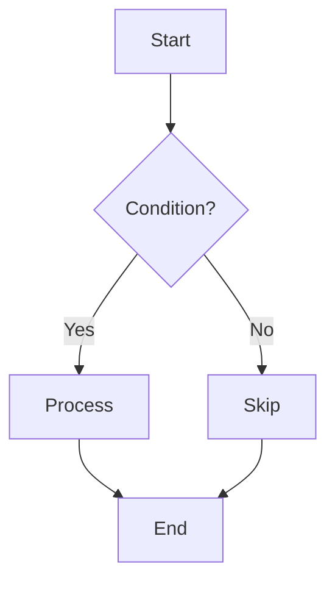
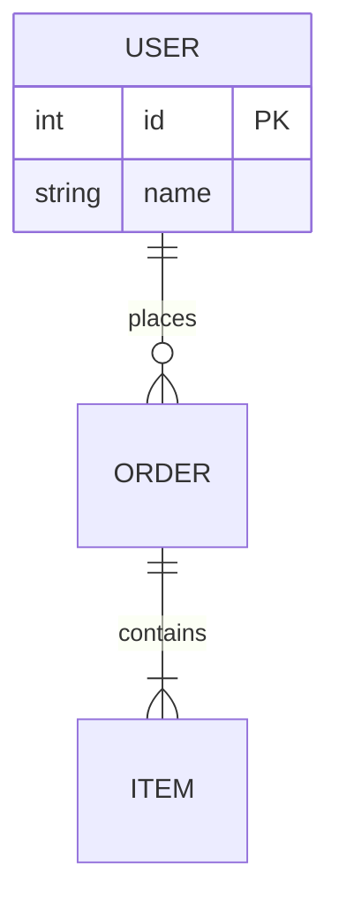
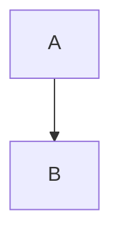

# Tech Diagram

Create technical diagrams using the appropriate technology for each diagram type.

## Technology Selection

| Diagram Type | Technology | Output Format |
|-------------|------------|---------------|
| Architecture | SVG in HTML | `.html` file |
| Flowchart | Mermaid | Markdown code block |
| ER Diagram | Mermaid | Markdown code block |
| Sequence Diagram | Mermaid | Markdown code block |
| State Diagram | Mermaid | Markdown code block |
| Class Diagram | Mermaid | Markdown code block |
| Animated Demo | SVG + anime.js | `.html` file |

## Mermaid Diagrams

Use Mermaid for static diagrams embedded in Markdown. See [mermaid-patterns.md](references/mermaid-patterns.md) for syntax reference.

### Flowchart Example
````markdown

````

### ER Diagram Example
````markdown

````

## SVG Architecture Diagrams

Use embedded SVG in HTML for architecture diagrams that need:
- Custom styling and colors
- Precise layout control
- Gradients and shadows

See [svg-architecture.md](references/svg-architecture.md) for component patterns.

### Key Components
- **Rectangle boxes**: Services, components, modules
- **Circles**: Start/end points
- **Diamonds**: Conditions, decisions
- **Arrows**: Data flow, relationships
- **Dashed containers**: Groups, boundaries

### Color Scheme
See [color-schemes.md](references/color-schemes.md) for the dark theme palette:
- Primary (cyan): `#00acc1` - Active states
- Success (green): `#48bb78` - Complete states
- Warning (orange): `#f6ad55` - Running states
- Error (red): `#f56565` - Failed states

## Animated Demos

Use SVG + anime.js for interactive workflow demonstrations. Based on template: [animation-template.html](assets/animation-template.html)

### Features
- Step-by-step playback control
- Timeline panel showing execution progress
- Data packet animations
- State transitions with color changes

### When to Create Animated Demo
- Explaining scheduler/executor workflows
- Demonstrating algorithm execution
- Showing system initialization sequences
- Illustrating request processing pipelines

### Animation Structure
1. Define SVG components (boxes, arrows, packets)
2. Create step array with actions and messages
3. Implement control functions (playStep, playAll, reset)
4. Add timeline panel for progress tracking

## Output Guidelines

### Mermaid Diagrams (Flowchart, ER, Sequence, etc.)
Write Mermaid code blocks directly in Markdown documents:
```markdown

```

### HTML Diagrams (Architecture, Animation)
1. Create the `.html` file in project's docs or assets folder
2. Take a screenshot of the diagram
3. Embed in Markdown with screenshot + link:

```markdown


[View interactive version](./docs/system-architecture.html)
```

For animated demos:
```markdown


[View animation](./animations/scheduler-demo.html) - Supports step-by-step playback
```

### File Naming
- Architecture: `{system}-architecture.html`
- Animation: `{system}-{workflow}.html`
- Screenshots: `./images/{same-name}.png`

### HTML File Requirements
- Include all CSS inline
- Use CDN for anime.js
- Make file self-contained (single file, no external dependencies)
- Add Chinese/English labels as needed
