# Mermaid Patterns

## Flowchart (流程图)

### Basic Syntax
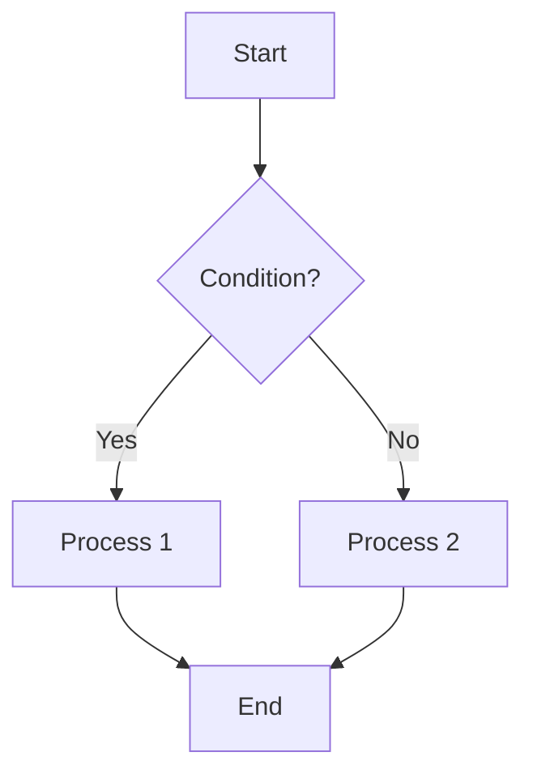

### Node Shapes
```
[text]      Rectangle
(text)      Rounded rectangle
([text])    Stadium/pill
[[text]]    Subroutine
[(text)]    Cylinder (database)
((text))    Circle
{text}      Diamond
{{text}}    Hexagon
[/text/]    Parallelogram
[\text\]    Parallelogram alt
[/text\]    Trapezoid
[\text/]    Trapezoid alt
```

### Arrow Types
```
-->     Arrow
---     Line
-.->    Dotted arrow
==>     Thick arrow
--text--> Arrow with text
```

### Subgraphs
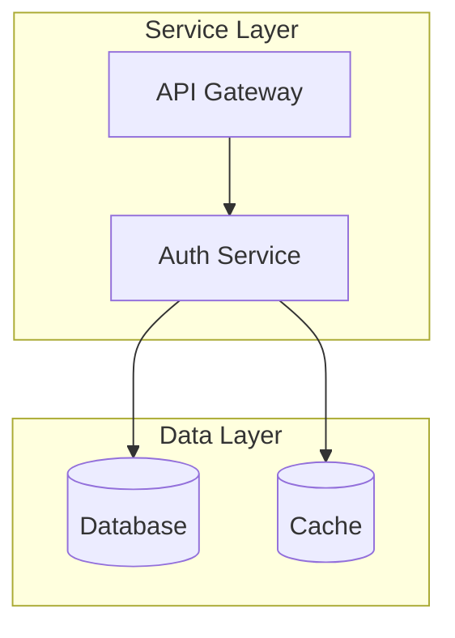

---

## ER Diagram (ER图)

### Basic Syntax
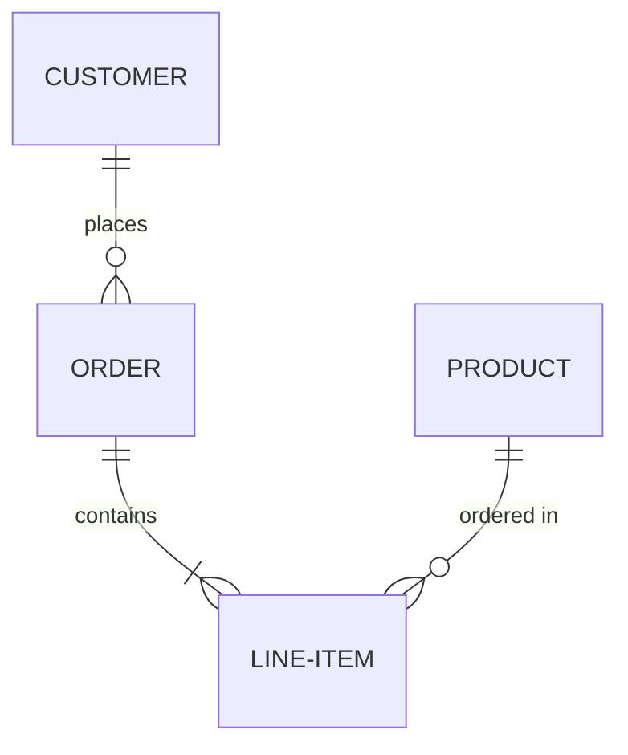

### Relationship Types
```
||--||   One to one
||--o{   One to zero or more
||--|{   One to one or more
o|--o{   Zero or one to zero or more
```

### With Attributes
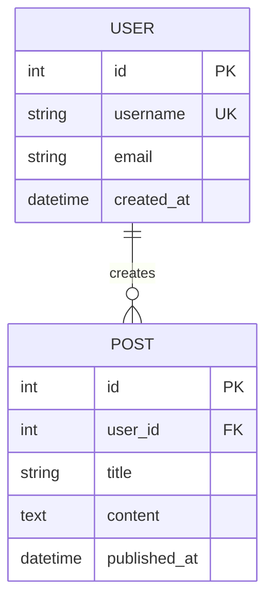

### Attribute Types
- `PK` - Primary Key
- `FK` - Foreign Key
- `UK` - Unique Key

---

## Sequence Diagram (时序图)

### Basic Syntax
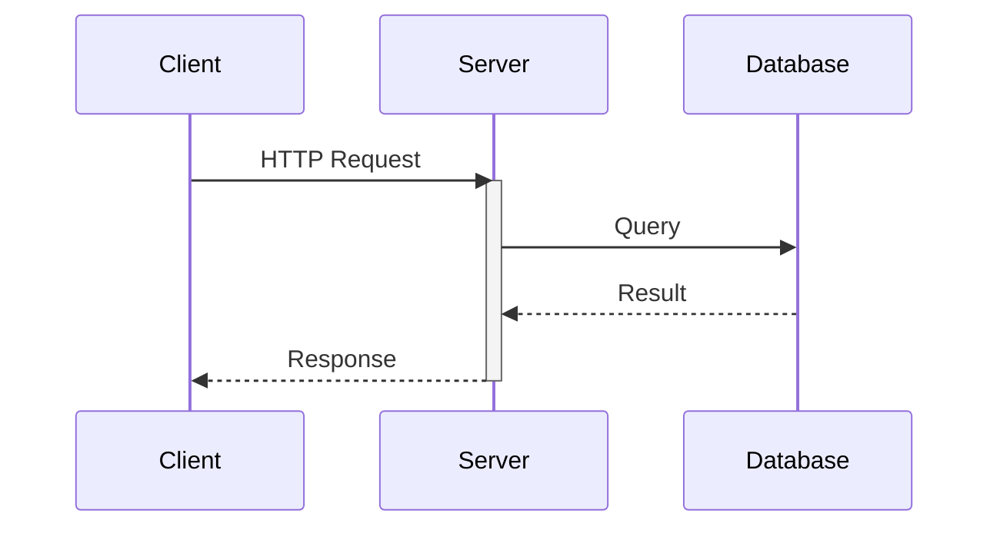

### Message Types
```
->      Solid line without arrow
-->     Dotted line without arrow
->>     Solid line with arrow
-->>    Dotted line with arrow
-x      Solid line with x (async)
--x     Dotted line with x
-)      Solid line with open arrow (async)
--)     Dotted line with open arrow
```

### Loops and Conditions
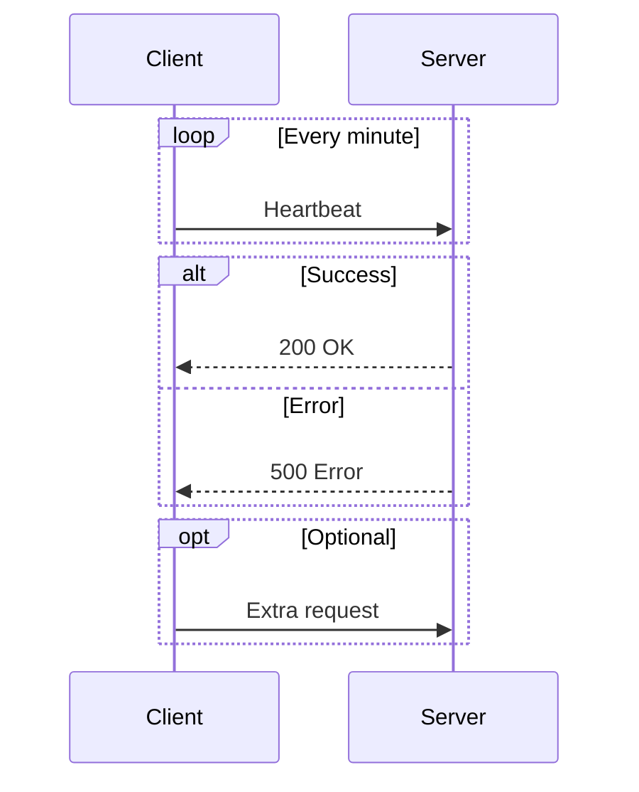

---

## State Diagram (状态图)

### Basic Syntax
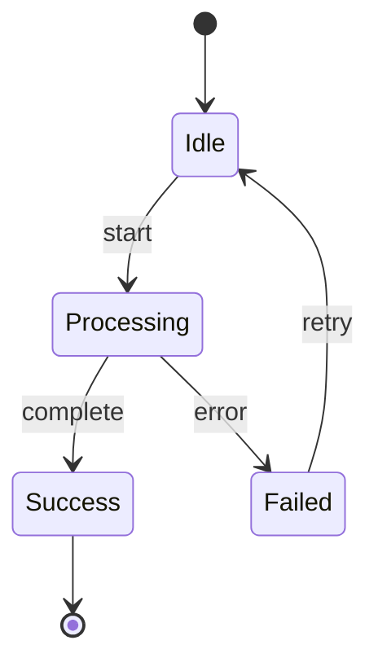

### Composite States
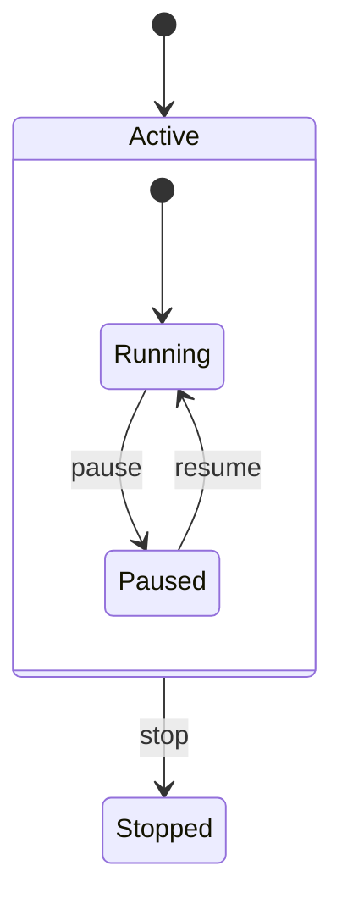

---

## Class Diagram (类图)

### Basic Syntax
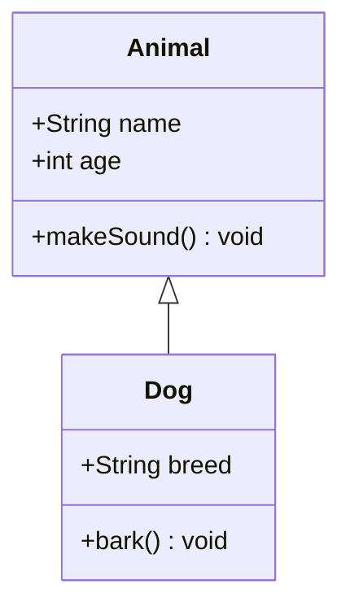

### Relationships
```
<|--    Inheritance
*--     Composition
o--     Aggregation
-->     Association
--      Link (solid)
..>     Dependency
..|>    Realization
..      Link (dashed)
```

### Multiplicity
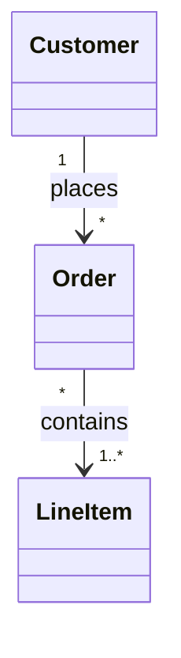

---

## Styling

### Theme Options
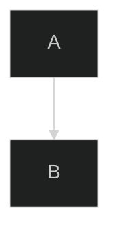

Available themes: `default`, `dark`, `forest`, `neutral`

### Custom Styles
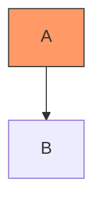

### Notes
- Use `%%` for comments
- Direction: `TD` (top-down), `LR` (left-right), `BT`, `RL`
